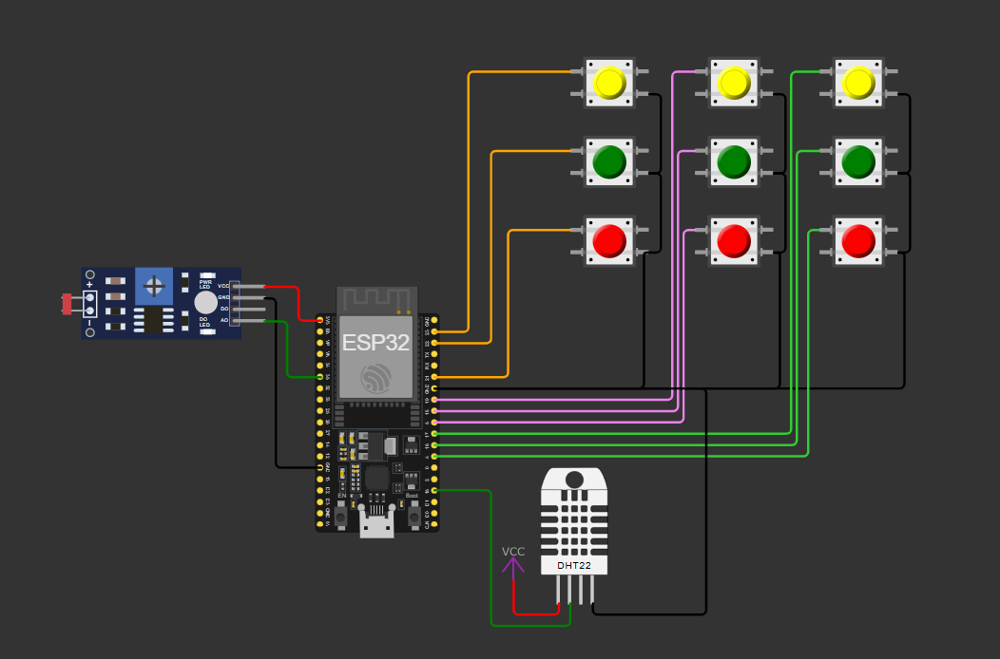

# FIAP - Faculdade de Informática e Administração Paulista

 

# Monitoramento de Solo e Agricultura de Precisão - Dispositivo ESP32

## Nome do grupo: Leno's

## 👨‍🎓 Integrantes: 
- <a href="https://www.linkedin.com/in/leon-gonzalez-8701b9199/">Pablo Leon Dimauro Gonzalez</a>

## 👩‍🏫 Professores:
### Tutor(a) 
<a href="https://www.linkedin.com/in/andregodoichiovato/">André Godoi</a>
### Coordenador(a)
- <a href="https://www.linkedin.com/in/andregodoichiovato/">André Godoi</a>

## 📜 Descrição

Este projeto implementa um sistema de **monitoramento de solo com ESP32**, que envia as informações coletadas e envia para um broker MQTT, onde uma central recebe, grava em banco de dados Oracle e trata as informações enviadas. Os dados enviados são umidade do solo, temperatura do solo e niveis baixo, medio e alto dos macronutrientes NPK.

O ESP32 envia mensagens MQTT para o broker Flespi a cada 30 minutos, que serão tratadas pela central, um script escrito em python.

A central por sua vez é responsável por receber as mensagens que vão para o tópico "central", para onde cada dispositivo em campo envia as mensagens.

As mensagens são tratadas e gravadas em banco de dados Oracle. Após isso, os dados são lidos e analisados, indicando situações criticas, como escassez hídrica ou pH muito baixo.

Exemplo dos dados transmitidos:

time; temperature_2m_min; temperature_2m_max; precipitation_probability_max;

O circuito foi montado conforme imagem abaixo:

### Adaptações

Para que o projeto fosse realizado com o simulador Wokwi, foram necessárias algumas adaptações, são elas:

* 3 botões para indicar nivel baixo, medio ou alto, para os 3 macronutrientes NPK.
* pH do solo foi obtido com o sensor LDR e uma conversao dos valores maximos e minimos do sensor para 0 a 14, conforme escala pH.
* Para temperatura e umidade do solo, foi utilizado o sensor DHT22.

## 📁 Estrutura de pastas

Dentre os arquivos e pastas presentes na raiz do projeto, definem-se:

- <b>assets</b>: aqui estão os arquivos de imagem.

- <b>src</b>: Código criado para funcionamento do ESP32.
  
- <b>README.md</b>: Este mesmo arquivo, onde é descrito todo o projeto.

## 🔧 Como executar o código

Para executar o projeto, é necessário ter algumas extensões instaladas, como:

  * Platform.io
  * Wokwi Simulator

Como broker MQTT, utilizamos o Flespi.io. Ele permite um numero limitado de troca de mensagens, mas o suficiente para testar o projeto. Acesse o site, crie uma conta e copie o token atribuido a sua conta.

Esse token será utilizado para autenticar o acesso ao servidor.

O dispositivo ESP32, utiliza as bibliotecas PubSubClient e DHTesp, que serão instaladas automaticamente pelo platform.io ao abrir a pasta **LenoAgro_device** no vscode. Isso é necessário para que o platform.io funcione corretamente.

Após o platform.io carregar completamente, aperte CTRL + ALT + B, para fazer um build do programa.

Abra o diagram.json e inicie uma simulação. Confira se está funcionando como esperado.

## 🗃 Histórico de lançamentos

* 0.1.0 - 15/10/25

## 📋 Licença

<a property="dct:title" rel="cc:attributionURL" href="https://github.com/agodoi/template">MODELO GIT FIAP</a> por <a rel="cc:attributionURL dct:creator" property="cc:attributionName" href="https://fiap.com.br">Fiap</a> está licenciado sobre <a href="http://creativecommons.org/licenses/by/4.0/?ref=chooser-v1" target="_blank" rel="license noopener noreferrer" style="display:inline-block;">Attribution 4.0 International</a>.

