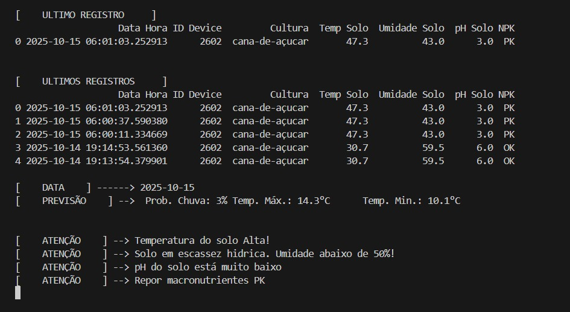
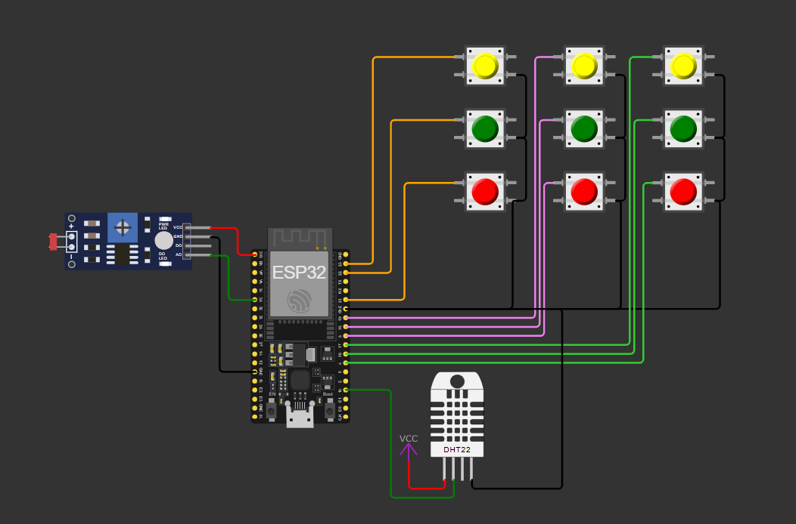
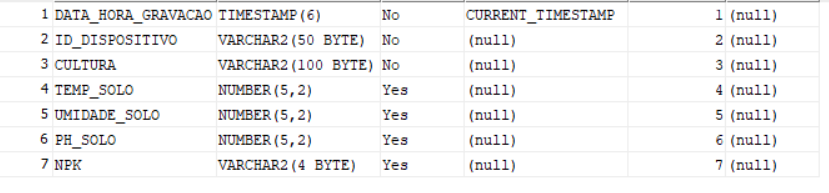

# FIAP - Faculdade de Informática e Administração Paulista

 

# Sistema IoT para Monitoramento de Solo e Agricultura de Precisão

## Nome do grupo: Leno's

## 👨‍🎓 Integrantes: 
- <a href="https://www.linkedin.com/in/leon-gonzalez-8701b9199/">Pablo Leon Dimauro Gonzalez</a>

## 👩‍🏫 Professores:
### Tutor(a) 
<a href="https://www.linkedin.com/in/andregodoichiovato/">André Godoi</a>
### Coordenador(a)
- <a href="https://www.linkedin.com/in/andregodoichiovato/">André Godoi</a>

## 📜 Descrição

Este projeto implementa um sistema de **monitoramento de solo com ESP32**, que envia as informações coletadas e envia para um broker MQTT, onde uma central recebe, grava em banco de dados Oracle e trata as informações enviadas. Os dados enviados são umidade do solo, temperatura do solo e niveis baixo, medio e alto dos macronutrientes NPK.

O projeto tambem conta com a previsão climática dos próximos 7 dias, que é feita pela central, o que auxilia o produtor na tomada de decisões.

A central por sua vez é responsável por receber as mensagens que vão para o tópico "central", para onde cada dispositivo em campo envia as mensagens.

As mensagens são tratadas e gravadas em banco de dados Oracle. Após isso, os dados são lidos e analisados, indicando situações criticas, como escassez hídrica ou pH muito baixo.

A central possibilita o monitoramento dos campos em que estão instalados os dispositivos, sendo a primeira linha o ultimo registro e logo apos uma tabela com os ultimos 5 registros.

Em seguida, podemos ver a previsão do tempo para o dia de hoje, indicando temperaturas minima e máxima e probabilidade de chuva. As previsões são realizadas para a cidade de São Paulo.

Os alertas após analise dos dados recebidos do dispositivo, são exibidos na parte de baixo da tela, e so aparecem quando detectado situação critica em algum dos sensores. Conforme imagem abaixo:

Exemplo dos dados transmitidos:

time; temperature_2m_min; temperature_2m_max; precipitation_probability_max;

O circuito foi montado conforme imagem abaixo:

### Adaptações

Para que o projeto fosse realizado com o simulador Wokwi, foram necessárias algumas adaptações, são elas:

* 3 botões para indicar nivel baixo, medio ou alto, para os 3 macronutrientes NPK.
* pH do solo foi obtido com o sensor LDR e uma conversao dos valores maximos e minimos do sensor para 0 a 14, conforme escala pH.
* Para temperatura e umidade do solo, foi utilizado o sensor DHT22.

## 📁 Estrutura de pastas

Dentre os arquivos e pastas presentes na raiz do projeto, definem-se:

- <b>assets</b>: contém arquivos de mídia e outros elementos não estruturados, como imagens de apoio.

- <b>LenoAgro_central</b>: módulo responsável pela central de dados.
  - <b>main.py</b>: script principal que recebe os dados via MQTT, processa e grava no banco de dados.

- <b>LenoAgro_device</b>: módulo referente ao dispositivo IoT baseado em ESP32.
  - <b>assets</b>: recursos para readme.md do dispositivo.

  - <b>src</b>: código-fonte do firmware do dispositivo.

  - <b>diagram.json</b>: diagrama de conexão dos sensores (usado no Wokwi).

  - <b>platformio.ini</b>: arquivo de configuração do projeto PlatformIO.

  - <b>readme.md</b>: documentação específica do módulo do dispositivo.

- <b>Readme.md</b>: documentação principal do projeto, com instruções gerais e visão do sistema.
## 🔧 Como executar o código

Para executar o projeto, é necessário ter algumas extensões instaladas, como:

  * Platform.io
  * Wokwi Simulator

Também precisamos de acesso a um **banco de dados Oracle**.

Como broker MQTT, utilizamos o Flespi.io. Ele permite um numero limitado de troca de mensagens, mas o suficiente para testar o projeto. Acesse o site, crie uma conta e copie o token atribuido a sua conta.

Esse token será utilizado para autenticar o acesso ao servidor.

O dispositivo ESP32, utiliza as bibliotecas PubSubClient e DHTesp, que serão instaladas automaticamente pelo platform.io ao abrir a pasta **LenoAgro_device** no vscode. Isso é necessário para que o platform.io funcione corretamente.

Após o platform.io carregar completamente, aperte CTRL + ALT + B, para fazer um build do programa.

Abra o diagram.json e inicie uma simulação. Confira se está funcionando como esperado.

O script em python, utiliza as bibliotecas paho-mqtt para gerenciamento da comunicação MQTT e conexão com o broker, oracledb para conexão e operações no banco de dados e pandas para visualização de tabelas. Verifique se estão instaladas corretamente.

Instaladas as bibliotecas, abra um terminal de comando na pasta **LenoAgro_central** e inicie o script **main.py**. Ele ficará rodando, exibindo as informações coletadas no banco de dados e gravando as informações recebidas dos dispositivos. O script tambem realiza previsão do tempo nos proximos 7 dias, consultando a API da Open Meteo todos os dias as 06:30 da manhã, e exibindo a previsão do dia de hoje.

O banco de dados é composto por apenas uma tabela, conforme mostra imagem abaixo:

## 🗃 Histórico de lançamentos

* 0.1.0 - 15/10/25

## 📋 Licença

<a property="dct:title" rel="cc:attributionURL" href="https://github.com/agodoi/template">MODELO GIT FIAP</a> por <a rel="cc:attributionURL dct:creator" property="cc:attributionName" href="https://fiap.com.br">Fiap</a> está licenciado sobre <a href="http://creativecommons.org/licenses/by/4.0/?ref=chooser-v1" target="_blank" rel="license noopener noreferrer" style="display:inline-block;">Attribution 4.0 International</a>.

